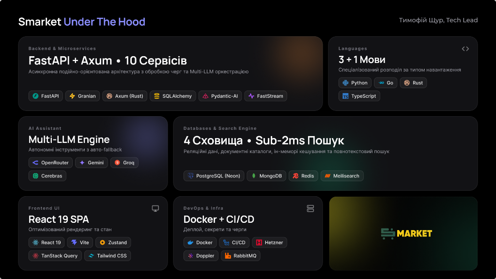
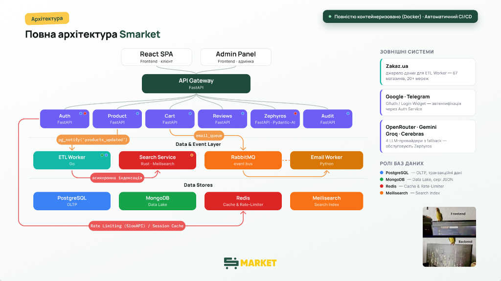

# 🛒 Smarket — Інтелектуальний Агрегатор Цін та Продуктів

<p align="center">
  <b>Високонавантажений мікросервісний агрегатор цін на продукти харчування в Україні з ШІ-асистентом, надшвидким пошуком та автоматичним ETL-пайплайном.</b>
</p>

<p align="center">
  
  
  
  
  
  
  
</p>

---

## ⚡ Smarket Under The Hood



---

## 🌟 Про Проєкт

**Smarket** — це інноваційна платформа для розумного моніторингу, порівняння цін та аналізу товарного асортименту провідних супермаркетів України (**Novus, Сільпо, Ашан, Varus, ЕкоМаркет** тощо). 

Проєкт об'єднує **10 ізольованих мікросервісів**, написаних на **Python, Rust та Go**, автоматичний ETL-пайплайн для збору даних з 67+ супермаркетів, надшвидкий пошуковий двигун (<2ms затримки) та автономного ШІ-помічника **Zephyros**, здатності якого охоплюють порівняння цін, управління кошиками та рекомендації.

### 📊 Масштаб та Ключові Метрики:
* **70,593+ рядків чистого коду** у монорепозиторії (Backend, Frontend, Tests, CI).
* **10 спеціалізованих мікросервісів** під унікальні типи навантаження.
* **4 бази даних & сховища**: PostgreSQL (OLTP), MongoDB (Data Lake), Redis (Кеш/Rate-Limiting), Meilisearch (Повнотекстовий пошук).
* **Multi-LLM Engine**: Інтелектуальний fallback між Groq, Gemini, OpenRouter та Cerebras.
* **Sub-2ms затримка пошуку** завдяки Rust-сервісу `search_service`.

---

## 🗺️ Глобальна Архітектура Системи



### 🔄 Потік даних та взаємодія:
1. **Клієнтський рівень**: React SPA (`https://smarket-7go.pages.dev`) та Admin Panel (`https://smarket-admin.pages.dev`) надсилають REST-запити до єдиної точки входу.
2. **API Gateway (`:8080`)**: Валідує CORS, перевіряє JWT-токени та проксує запити до відповідного мікросервісу з додаванням `X-User-Id` та `X-User-Role`.
3. **ETL Конвеєр**: Go-воркер `products_etl` раз на 2 години збирає дані з API Zakaz.ua, зберігає сирі JSON у **MongoDB**, робить батчевий `UPSERT` у **PostgreSQL**, оновлює індекс **Meilisearch** та викликає `NOTIFY products_updated`.
4. **Реактивне кешування**: `product_service` слухає PostgreSQL `LISTEN/NOTIFY` та миттєво інвалідує кеш категорій і супермаркетів при оновленнях.
5. **Асинхронні події**: Брокер **RabbitMQ** обробляє чергу транзакційних листів (`email_worker`) та системних аудиторських логів (`audit_service`).

---

## 🧩 Каталог Мікросервісів

| № | Сервіс | Стек / Технології | Внутрішній Порт | Роль у системі |
|---|---|---|---|---|
| 1 | **`gateway`** | Python 3.11 / FastAPI / Granian | `8080` (Ext) | Єдина точка входу, JWT Route Proxy, CORS validation |
| 2 | **`auth_service`** | Python 3.11 / FastAPI / Redis / SlowAPI | `8001` | Авторизація, JWT, Google OAuth, Telegram Login, Rate Limiting |
| 3 | **`product_service`** | Python 3.11 / FastAPI / Async PG | `8000` | Read-Only каталог товарів, категорій, цін та супермаркетів |
| 4 | **`cart_service`** | Python 3.11 / FastAPI / Async PG | `8002` | Кошики, обрані товари (Favorites), шеринг чеків з AI-описами |
| 5 | **`reviews_service`** | Python 3.11 / FastAPI / Async PG | `8004` | Рейтинги та відгуки покупців до товарів |
| 6 | **`search_service`** | **Rust 1.80+** / Axum / Meilisearch / Tokio | `8083` | Тонкий проксі над Meilisearch (<2ms), розгортання категорій |
| 7 | **`zephyros_agent`** | Python 3.11 / Pydantic-AI / Multi-LLM | `8005` | ШІ-Асистент "Zephyros", аналіз цін, формування чеків |
| 8 | **`products_etl`** | **Go 1.26** / `pgx v5` / MongoDB / RabbitMQ | `8082` | Парсер Zakaz.ua, батчевий UPSERT, Meilisearch sync |
| 9 | **`email_worker`** | Python 3.11 / FastStream / RabbitMQ | `8085` | Consumer черги `email_queue`, транзакційні email (Resend) |
| 10 | **`audit_service`** | Python 3.11 / FastStream / RabbitMQ | `8006` | Аудит-логи дій користувачів та адміністраторів |

---

## 🤖 ШІ-Асистент "Zephyros" (`zephyros_agent`)

Сервіс **Zephyros Agent** — це інтелектуальний помічник покупця, побудований на фреймворку **Pydantic-AI**.

### Основні можливості:
* **Multi-LLM Circuit Breaker**: Динамічне перемикання між провайдерами у випадку збоїв чи перевищення лімітів:
  1. **Groq** (`llama-3.3-70b-versatile`)
  2. **Google Gemini** (`gemini-2.5-flash`)
  3. **OpenRouter** (`anthropic/claude-3.5-haiku` / `deepseek-r1`)
  4. **Cerebras** (`llama-3.1-70b`)
* **Автономні інструменти (8 AI Tools)**: `search_and_compare_offers`, `get_user_cart`, `add_product_to_cart`, `compare_cart_stores`, `get_product_reviews`, `create_product_review` тощо.
* **Структуровані UI-блоки (`ZephyrosResponse`)**: Асистент повертає JSON із графічними елементами (інтерактивні таблиці порівняння, кнопки швидкого додавання в кошик в 1 клік).

---

## 🛠 Стек Технологій

```text
Backend Microservices:  Python 3.11 (FastAPI, Granian, Pydantic-AI, FastStream), Rust 1.80+ (Axum), Go 1.26 (pgx/v5)
Frontend UI:            React 19, Vite, TypeScript, Tailwind CSS v4, Zustand, TanStack Query (React Query)
Databases & Caching:    PostgreSQL 16 (AsyncPG / Alembic), MongoDB 7.0 (Data Lake), Redis 7 (SlowAPI / Cache), Meilisearch
Message Bus & Async:    RabbitMQ 3.13 (AMQP 0-9-1)
DevOps & Cloud:         Docker Compose, Hetzner Cloud (Backend), Cloudflare Pages (Frontend), GitHub Actions, Doppler
```

---

## 🧪 Перевірка та Тестування

Для перевірки працездатності всіх мікросервісів використовується єдиний автоматичний тест-драйвер:

```bash
# Запуск інтеграційного тест-драйвера всіх мікросервісів
python scripts/run_service_tests.py

# Окремі unit-тести для Python сервісів:
cd services/auth_service && uv run pytest
cd services/product_service && uv run pytest
cd services/cart_service && uv run pytest
cd services/gateway && uv run pytest
cd services/zephyros_agent && uv run pytest

# Go ETL тести:
cd services/products_etl && go test -v ./...

# Rust Search Service тести:
cd services/search_service && cargo test
```

---

## 📚 Технічна Документація

Детальна специфікація та технічні керівництва розташовані в директорії [`docs/`](./docs/):

* 📘 [Специфікація для AI-Агентів та Карта Монорепозиторію (`AGENTS.md`)](./AGENTS.md)
* ⚙️ [Бекенд та DevOps — Вичерпна Архітектура з Метриками](./docs/DEVOPS_AND_BACKEND.md)
* 📡 [Ендпоінти та Контракти Backend API](./docs/backend_endpoints.md)
* 🔍 [Гайд по Пошуку та Фільтрації в Meilisearch](./docs/search_filtering_guide.md)
* 🛍️ [Специфікація Zakaz.ua API](./docs/zakaz_api.md)

---

## 👥 Команда Проєкту & Ліцензія

* **Тимофій Щур** — Tech Lead, Core Backend Engineer ([@ashfromsky](https://github.com/ashfromsky))
* **Соботович Ілля** — Frontend Developer ([@IllyaStack](https://github.com/IllyaStack))
* **Шевченко Максим** — Full Stack Developer, Project Manager ([@MxmXyn245](https://github.com/MxmXyn245))
* **Мироненко Владислав** — Full Stack Developer ([@Indolop](https://github.com/Indolop))
* **Фесун Ігор** — UI/UX Designer & Prototyper
* **Мельникова Катерина** — Business Analyst / Brand Designer

---

Проєкт розповсюджується під відкритою ліцензією **[MIT License](./LICENSE)**.
