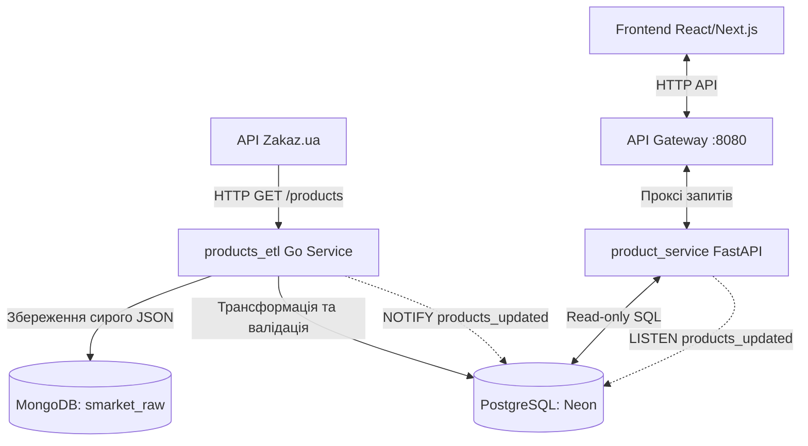

Цей документ містить повний технічний опис товарного каталогу проекту **SMARKET**, логіки роботи сервісів збору даних (**products_etl**) та надання доступу (**product_service**), схем даних у базі, а також детальних HTTP-ендпоінтів для інтеграції з фронтенд-додатком (React / Next.js).

---

## 🗺️ 1. Загальна архітектура та потік даних

Система побудована на базі мікросервісів. Фронтенд-додаток комунікує з бекендом виключно через **API Gateway**, який проксіює відповідні запити до внутрішніх сервісів безпосередньо.



### Компоненти системи:

1. **Джерело даних (Zakaz.ua API):** Публічні ендпоінти торгових мереж (Ашан, Novus, Metro, Ultramarket тощо), звідки викачуються товари, ціни, наявність та фото.
2. **Сервіс збору даних (`products_etl` — Go, порт `:8082`):**
    - **Seeder:** На старті сервісу завантажує всі активні магазини з Zakaz.ua та робить Upsert у Postgres.
    - **Scheduler:** Кожні 2 години (або при старті для магазинів без цін) додає завдання на парсинг у чергу RabbitMQ.
    - **Extract & Load Worker:** Забирає завдання з черги, качає товари по категоріях та складає сирі JSON-сторінки в MongoDB для виключення втрати даних при збоях мережі.
    - **Transform & Load Worker:** Постійно вичитує документи з Mongo, валідує EAN-13, чистить дані, конвертує ціни, вибирає найкраще зображення, робить масовий `UPSERT` у Postgres, а також надсилає сповіщення `NOTIFY` в базу.
3. **Сервіс надання даних (`product_service` — FastAPI/Python, порт `:8082` внутрішній / проксіюється):**
    - Швидкий асинхронний Read-only клієнт до PostgreSQL.
    - Отримує нотифікації `LISTEN products_updated` про оновлення асортименту магазинів для майбутньої інвалідації кешу в реальному часі.
4. **Шлюз (`API Gateway` — FastAPI/Python, порт `:8080`):**
    - Головна точка входу для фронтенду.
    - Маршрутизує запити виду `/api/v1/products/*` та `/api/v1/stores/*` на `product_service`.

---

## ⚡ 2. Важливі правила обробки та формат даних

Щоб спростити роботу фронтенду, сервіс `products_etl` стандартизує та очищує дані під час фази трансформації:

### 💵 Ціни та Знижки (Prices & Discounts)

- **Стандартизація валюти:** Zakaz.ua повертає ціни в **копійках** (цілі числа, наприклад `10890`). ETL-воркер автоматично ділить ціни на `100.0` та зберігає їх у гривнях (UAH) як тип `NUMERIC(10,2)`.
- **Фронтенд отримує ціни у вигляді дробових чисел (Float):** наприклад, `108.90` (ціна продажу) та `120.50` (стара ціна, якщо є знижка).
- **Актуальність:** Ендпоінт каталогів повертає останню записану ціну для кожного товару в конкретному магазині. Поле `old_price` заповнюється лише тоді, коли товар продається по знижці, в інших випадках воно дорівнює `null`.

### 🖼️ Зображення товарів (Image URLs)

- Поле `image_url` містить очищене та пряме посилання на найбільше доступне фото.
- Зі структури `img` від Zakaz.ua автоматично обирається найбільший роздільний формат з пріоритетом: `s1350x1350` ➔ `s350x350` ➔ `s200x200` ➔ `s150x150`. Якщо зображення задано простим рядком, береться цей рядок.

### 🏷️ Бренди та Виробники (Brands)

- Поле `brand` автоматично резолвиться. Якщо плоске поле `brand` порожнє, ETL шукає назву торгової марки у вкладеному об’єкті `producer.trademark`. Якщо нічого не знайдено, записується пустий рядок `""` або `null`.

### 🔍 Дедуплікація та Штрих-коди (EAN & Store Product ID)

- **Дедуплікація за EAN:** Якщо товар має валідний штрих-код EAN-13 (перевіряється довжина та контрольна сума, а також очищуються лідируючі нулі з GTIN-14), він вважається **глобальним продуктом** і записується в `canonical_ean`. Це дозволяє порівнювати один і той самий товар у різних супермаркетах.
- **Товари без штрих-коду:** Багато товарів (наприклад, вагові овочі, кулінарія або власні марки) не мають EAN. Вони зберігаються з `canonical_ean = null` та ідентифікуються за унікальним `store_product_id` (SKU магазину).

---

## 🗄️ 3. Схема таблиць бази даних

Для розуміння структури зв’язків нижче наведено схему PostgreSQL:

### Таблиця `stores` (Супермаркети)

Зберігає торгові точки, синхронізовані з Zakaz.ua.
* `external_id` (`TEXT`, PK) — зовнішній ID магазину (наприклад, `"48215803"`).
* `name` (`TEXT`, NOT NULL) — назва магазину (наприклад, `"Ашан Кільцева"`).
* `retail_chain` (`TEXT`, NOT NULL) — назва мережі нижнім регістром (`"auchan"`, `"novus"`, `"metro"` тощо).
* `city` (`TEXT`, NULL) — код міста (`"kiev"` (у Zakaz саме `kiev`, а не `kyiv`), `"lviv"` тощо).
* `is_active` (`BOOLEAN`, NOT NULL) — чи активний магазин для парсингу.
* `synced_at` (`TIMESTAMPTZ`, NOT NULL) — дата останньої синхронізації метаданих.
* `last_parsed_at` (`TIMESTAMPTZ`, NULL) — час останнього успішного парсингу магазину ETL-воркером.

### Таблиця `categories` (Категорії товарів)

Плоский список категорій верхнього рівня з Zakaz.ua. Слаги глобальні (однакові для всіх мереж — Ашан, Novus, Metro), тож прив'язка «поза залежністю від магазину» вже виконана. Наповнюється ETL-воркером: `SeedCategories` (при старті) + ліниве створення в `ResolveCategoryID` при зустрічі нового slug.
* `id` (`SERIAL`, PK) — внутрішній ID категорії.
* `slug` (`TEXT`, UNIQUE, NOT NULL) — slug верхнього рівня з API Zakaz (наприклад, `"fresh-meat"`).
* `name` (`TEXT`, NOT NULL) — українська назва з поля `title` API (наприклад, `"Свіже м'ясо"`).
* `created_at` (`TIMESTAMPTZ`, NOT NULL) — час створення запису.

### Таблиця `products` (Глобальний каталог товарів)

Єдиний перелік товарів, дедуплікований по штрих-коду.
* `id` (`BIGINT`, PK, SERIAL) — наш внутрішній унікальний ID товару.
* `canonical_ean` (`TEXT`, UNIQUE, NULL) — перевірений EAN-13 штрих-код (у коді моделей зветься `ean`).
* `store_product_id` (`TEXT`, NULL) — SKU товару (використовується для унікальності, якщо EAN немає).
* `title` (`TEXT`, NOT NULL) — назва товару.
* `brand` (`TEXT`, NULL) — бренд товару.
* `unit` (`TEXT`, NULL) — одиниця виміру (`"pcs"`, `"kg"`).
* `weight` (`FLOAT`, NULL) — вага або об’єм товару.
* `image_url` (`TEXT`, NULL) — посилання на зображення.
* `canonical_category_id` (`INTEGER`, NULL, FK ➔ `categories.id`, `ON DELETE SET NULL`) — посилання на категорію. Nullable: допускаються товари без категорії.
* `store_id` (`TEXT`, NULL, FK ➔ `stores.external_id`) — ID магазину, до якого прив'язаний товар, якщо у нього немає EAN (для локальних/вагових товарів).
* `created_at` (`TIMESTAMPTZ`, NOT NULL) — дата додавання товару в систему.

### Таблиця `store_products` (Зв’язок товарів із магазинами)

Junction table, яка визначає, які товари є в наявності у конкретних супермаркетах.
* `product_id` (`BIGINT`, PK, FK ➔ `products.id`) — ID товару.
* `store_id` (`TEXT`, PK, FK ➔ `stores.external_id`) — ID магазину.
* `store_product_id` (`TEXT`, NULL) — SKU цього товару в даній мережі.
* `first_seen_at` (`TIMESTAMPTZ`, NOT NULL) — час, коли товар вперше з’явився у цьому магазині.

### Таблиця `prices` (Лог цін товарів)

Іммутабельний часовий лог зміни вартості товарів.
* `id` (`BIGINT`, PK, SERIAL) — ID запису.
* `product_id` (`BIGINT`, FK ➔ `products.id`) — ID товару.
* `store_id` (`TEXT`, FK ➔ `stores.external_id`) — ID магазину.
* `price` (`NUMERIC(10,2)`, NOT NULL) — актуальна ціна в гривнях.
* `old_price` (`NUMERIC(10,2)`, NULL) — стара ціна без знижки в гривнях.
* `in_stock` (`BOOLEAN`, NOT NULL) — статус наявності товару (`true`/`false`).
* `recorded_at` (`TIMESTAMPTZ`, NOT NULL) — час фіксації ціни ETL-воркером.

---

## 🔌 4. Робочі ендпоінти API для Фронтенду

> ⚠️ **Важливо:** Усі запити фронтенд повинен відправляти на **API Gateway**: `http://localhost:8080/api/v1/...`
> 
> Гейтвей автоматично перенаправить запити до відповідних мікросервісів та додасть CORS заголовки.

---

### 🛍️ ГРУПА: Товари (`/api/v1/products`)

### 1. GET `/api/v1/products` — Отримання загального списку товарів

Повертає каталог товарів із можливістю гнучкої фільтрації, пошуку та пагінації.

- **Автентифікація:** Не потрібна.
- **Query параметри:**
    - `skip` (`int`, за замовчуванням `0`) — кількість товарів для пропуску.
    - `limit` (`int`, за замовчуванням `100`, максимум `1000`) — ліміт записів у відповіді.
    - `brand` (`string`, опціонально) — фільтрація по назві бренду (часткове співпадіння, регістронезалежно).
    - `category_id` (`int`, опціонально) — фільтрація по `canonical_category_id` (FK на `categories.id`).
    - `search` (`string`, опціонально) — пошук за назвою товару (регістронезалежно, наприклад `вода`).
    - `store_id` (`string`, опціонально) — показувати тільки товари, які продаються у конкретному магазині.
- **Приклад запиту:** `GET http://localhost:8080/api/v1/products?search=молоко&limit=2&store_id=48215803`
- **Формат відповіді (`200 OK`):**
    ```json
    [
      {
        "id": 1245,
        "ean": "4820002130098",
        "store_product_id": "04820002130098",
        "title": "Молоко Селянське ультрапастеризоване 2.5% 900г",
        "brand": "Селянське",
        "unit": "pcs",
        "weight": 900,
        "image_url": "https://img3.zakaz.ua/s350x350/m/04820002130098.jpg",
        "canonical_category_id": 12,
        "created_at": "2026-06-12T12:21:03.282114+00:00"
      },
      {
        "id": 1246,
        "ean": "4820123456789",
        "store_product_id": "04820123456789",
        "title": "Молоко Яготинське 2.6% 900г",
        "brand": "Яготинське",
        "unit": "pcs",
        "weight": 900,
        "image_url": "https://img3.zakaz.ua/s350x350/m/04820123456789.jpg",
        "canonical_category_id": 12,
        "created_at": "2026-06-12T12:21:05.102341+00:00"
      }
    ]
    ```

---

### 2. GET `/api/v1/products/by-store/{store_id}` — Каталог товарів магазину з актуальними цінами

**🔥 Ключовий ендпоінт для побудови сторінки магазину.** Повертає список товарів конкретного супермаркету, збагачених останніми зафіксованими цінами для цієї торгової точки.

- **Автентифікація:** Не потрібна.
- **Шлях (Path):**
    - `store_id` (`string`, обов’язковий) — унікальний зовнішній ID магазину з Zakaz.ua (наприклад `48215803`).
- **Query параметри:**
    - `skip` (`int`, за замовчуванням `0`) — пагінація.
    - `limit` (`int`, за замовчуванням `100`, максимум `500`) — ліміт товарів.
    - `category_id` (`int`, опціонально) — фільтрація товарів за категорією.
    - `search` (`string`, опціонально) — пошук товарів по назві в межах даного магазину.
    - `in_stock` (`bool`, опціонально) — фільтрація: `true` — тільки в наявності, `false` — тільки відсутні.
- **Приклад запиту:** `GET http://localhost:8080/api/v1/products/by-store/48215803?category_id=12&in_stock=true&limit=1`
- **Формат відповіді (`200 OK`):**
    ```json
    [
      {
        "id": 1245,
        "ean": "4820002130098",
        "store_product_id": "04820002130098",
        "title": "Молоко Селянське ультрапастеризоване 2.5% 900г",
        "brand": "Селянське",
        "unit": "pcs",
        "weight": 900,
        "image_url": "https://img3.zakaz.ua/s350x350/m/04820002130098.jpg",
        "canonical_category_id": 12,
        "created_at": "2026-06-12T12:21:03.282114+00:00",
        "latest_price": {
          "id": 88472,
          "product_id": 1245,
          "store_id": "48215803",
          "price": 41.50,
          "old_price": 48.90,
          "in_stock": true,
          "recorded_at": "2026-06-12T15:35:41.000000+00:00"
        }
      }
    ]
    ```
- **Помилки:**
    - `404 Not Found` — якщо магазину з вказаним `store_id` не існує в базі.

---

### 3. GET `/api/v1/products/{product_id}` — Детальна інформація про товар

Повертає повні дані про один товар разом з історією цін у **всіх** супермаркетах, де він продається. Дані про ціни містять інформацію про магазин.

- **Автентифікація:** Не потрібна.
- **Шлях (Path):**
    - `product_id` (`int`, обов’язковий) — внутрішній ID продукту в системі.
- **Приклад запиту:** `GET http://localhost:8080/api/v1/products/1245`
- **Формат відповіді (`200 OK`):**
    ```json
    {
      "id": 1245,
      "ean": "4820002130098",
      "store_product_id": "04820002130098",
      "title": "Молоко Селянське ультрапастеризоване 2.5% 900г",
      "brand": "Селянське",
      "unit": "pcs",
      "weight": 900,
      "image_url": "https://img3.zakaz.ua/s350x350/m/04820002130098.jpg",
      "canonical_category_id": 12,
      "created_at": "2026-06-12T12:21:03.282114+00:00",
      "prices": [
        {
          "id": 88472,
          "product_id": 1245,
          "store_id": "48215803",
          "price": 41.50,
          "old_price": 48.90,
          "in_stock": true,
          "recorded_at": "2026-06-12T15:35:41+00:00",
          "store": {
            "external_id": "48215803",
            "name": "Ашан Кільцева",
            "retail_chain": "auchan",
            "city": "kyiv",
            "is_active": true,
            "synced_at": "2026-06-12T15:30:00+00:00"
          }
        },
        {
          "id": 88510,
          "product_id": 1245,
          "store_id": "48201201",
          "price": 43.00,
          "old_price": null,
          "in_stock": true,
          "recorded_at": "2026-06-12T15:35:42+00:00",
          "store": {
            "external_id": "48201201",
            "name": "Novus Бажана",
            "retail_chain": "novus",
            "city": "kyiv",
            "is_active": true,
            "synced_at": "2026-06-12T15:30:00+00:00"
          }
        }
      ]
    }
    ```
- **Помилки:**
    - `404 Not Found` — якщо товару з таким `id` немає.

---

### 4. GET `/api/v1/products/{product_id}/stores` — Перелік магазинів продажу

Повертає спрощений список магазинів, де в наявності чи колись був зафіксований даний товар (через junction-таблицю `store_products`).

- **Автентифікація:** Не потрібна.
- **Шлях (Path):**
    - `product_id` (`int`) — внутрішній ID продукту.
- **Приклад запиту:** `GET http://localhost:8080/api/v1/products/1245/stores`
- **Формат відповіді (`200 OK`):**
    ```json
    {
      "id": 1245,
      "ean": "4820002130098",
      "store_product_id": "04820002130098",
      "title": "Молоко Селянське ультрапастеризоване 2.5% 900г",
      "brand": "Селянське",
      "unit": "pcs",
      "weight": 900,
      "image_url": "https://img3.zakaz.ua/s350x350/m/04820002130098.jpg",
      "canonical_category_id": 12,
      "created_at": "2026-06-12T12:21:03.282114+00:00",
      "store_products": [
        {
          "store_id": "48215803",
          "store_product_id": "04820002130098",
          "first_seen_at": "2026-06-12T12:35:41+00:00",
          "store": {
            "external_id": "48215803",
            "name": "Ашан Кільцева",
            "retail_chain": "auchan",
            "city": "kyiv",
            "is_active": true,
            "synced_at": "2026-06-12T15:30:00+00:00"
          }
        }
      ]
    }
    ```

---

### 5. GET `/api/v1/products/{product_id}/prices` — Історія цін товару

Повертає повну історію зміни цін на обраний товар з можливістю фільтрації за магазином. Корисно для побудови **графіків коливання цін**.

- **Автентифікація:** Не потрібна.
- **Шлях (Path):**
    - `product_id` (`int`) — внутрішній ID продукту.
- **Query параметри:**
    - `store_id` (`string`, опціонально) — показати історію цін лише для одного конкретного магазину.
    - `in_stock` (`bool`, опціонально) — фільтрація за наявністю.
    - `limit` (`int`, за замовчуванням `100`) — кількість записів історії.
- **Приклад запиту:** `GET http://localhost:8080/api/v1/products/1245/prices?store_id=48215803&limit=3`
- **Формат відповіді (`200 OK`):**
    ```json
    [
      {
        "id": 99231,
        "product_id": 1245,
        "store_id": "48215803",
        "price": 41.50,
        "old_price": 48.90,
        "in_stock": true,
        "recorded_at": "2026-06-12T15:35:41+00:00",
        "store": {
          "external_id": "48215803",
          "name": "Ашан Кільцева",
          "retail_chain": "auchan",
          "city": "kyiv",
          "is_active": true,
          "synced_at": "2026-06-12T15:30:00+00:00"
        }
      },
      {
        "id": 82104,
        "product_id": 1245,
        "store_id": "48215803",
        "price": 48.90,
        "old_price": null,
        "in_stock": true,
        "recorded_at": "2026-06-12T11:30:00+00:00",
        "store": {
          "external_id": "48215803",
          "name": "Ашан Кільцева",
          "retail_chain": "auchan",
          "city": "kyiv",
          "is_active": true,
          "synced_at": "2026-06-12T15:30:00+00:00"
        }
      }
    ]
    ```

---

### 6. GET `/api/v1/products/{product_id}/offers` — Актуальні пропозиції товару в магазинах

Повертає товар та список активних цінових пропозицій (`offers`) з різних магазинів у плоскому форматі. Ідеально підходить для порівняння цін на фронтенді (один запит — уся інформація про ціни та магазини).

- **Автентифікація:** Не потрібна.
- **Шлях (Path):**
    - `product_id` (`int`) — внутрішній ID продукту.
- **Query параметри:**
    - `in_stock` (`bool`, опціонально) — обмежити пропозиції лише товарами в наявності.
- **Приклад запиту:** `GET http://localhost:8080/api/v1/products/1245/offers?in_stock=true`
- **Формат відповіді (`200 OK`):**
    ```json
    {
      "id": 1245,
      "ean": "4820002130098",
      "store_product_id": "04820002130098",
      "title": "Молоко Селянське ультрапастеризоване 2.5% 900г",
      "brand": "Селянське",
      "unit": "pcs",
      "weight": 900,
      "image_url": "https://img3.zakaz.ua/s350x350/m/04820002130098.jpg",
      "canonical_category_id": 12,
      "created_at": "2026-06-12T12:21:03.282114+00:00",
      "offers": [
        {
          "store": {
            "external_id": "48215803",
            "name": "Ашан Кільцева",
            "retail_chain": "auchan",
            "city": "kyiv",
            "is_active": true,
            "synced_at": "2026-06-12T15:30:00+00:00"
          },
          "price": 41.50,
          "old_price": 48.90,
          "in_stock": true,
          "recorded_at": "2026-06-12T15:35:41+00:00"
        }
      ]
    }
    ```

---

### 7. GET `/api/v1/products/categories` — Отримання списку унікальних категорій

Повертає плоский список категорій верхнього рівня з Zakaz.ua з українськими назвами. Категорії створюються та оновлюються ETL-воркером автоматично (сайд при старті + ліниве створення при зустрічі нового slug).

- **Автентифікація:** Не потрібна.
- **Приклад запиту:** `GET http://localhost:8080/api/v1/products/categories`
- **Формат відповіді (`200 OK`):**
    ```json
    [
      {
        "id": 5,
        "slug": "milk-cheese-eggs",
        "name": "Молоко, сир, яйця"
      },
      {
        "id": 12,
        "slug": "fruits-vegetables",
        "name": "Фрукти та овочі"
      }
    ]
    ```

---

### 🏪 ГРУПА: Магазини (`/api/v1/stores`)

### 1. GET `/api/v1/stores` — Отримання списку магазинів

Повертає перелік супермаркетів у системі для вибору користувачем (наприклад, для вибору магазину перед показом каталогу).

- **Query параметри:**
    - `retail_chain` (`string`, опціонально) — фільтр за мережею (`auchan`, `novus`, `metro`).
    - `city` (`string`, опціонально) — фільтр за містом (`kyiv`, `lviv` тощо).
    - `is_active` (`bool`, опціонально) — тільки магазини, що зараз активно збираються.
    - `skip` (`int`, за замовчуванням `0`) — зсув пагінації.
    - `limit` (`int`, за замовчуванням `100`) — ліміт кількості результатів.
- **Приклад запиту:** `GET http://localhost:8080/api/v1/stores?retail_chain=novus&is_active=true`
- **Формат відповіді (`200 OK`):**
    ```json
    [
      {
        "external_id": "48201201",
        "name": "Novus Бажана",
        "retail_chain": "novus",
        "city": "kyiv",
        "is_active": true,
        "synced_at": "2026-06-12T15:30:00+00:00"
      }
    ]
    ```

---

### 2. GET `/api/v1/stores/{store_id}` — Деталі конкретного магазину

Повертає деталі про одну торгову точку.

- **Шлях (Path):**
    - `store_id` (`string`) — зовнішній ID магазину.
- **Приклад запиту:** `GET http://localhost:8080/api/v1/stores/48201201`
- **Формат відповіді (`200 OK`):**
    ```json
    {
      "external_id": "48201201",
      "name": "Novus Бажана",
      "retail_chain": "novus",
      "city": "kyiv",
      "is_active": true,
      "synced_at": "2026-06-12T15:30:00+00:00"
    }
    ```

---

## 🛠️ 5. Робочі ендпоінти `products_etl` (для розробки та дебагу)

Go-сервіс `products_etl` має власну Swagger-документацію на порті `8082` (доступна напряму в локальній мережі) та надає корисні ендпоінти:

- **Swagger UI:** `http://localhost:8082/docs/index.html`
- **Healthcheck:** `GET http://localhost:8082/health` ➔ `{"status": "ok"}`
- **Ендпоінт дебагу парсингу:** `GET http://localhost:8082/product/get`
    - Дозволяє подивитися, що саме повертає Zakaz.ua у цю секунду.
    - **Query параметри:** `store_id` (обов’язковий), `category_id` (обов’язковий).
    - **Приклад запиту:** `GET http://localhost:8082/product/get?store_id=48215803&category_id=4820000`
    - Повертає сирий JSON масиву товарів напряму з Zakaz.ua (де ціни в копійках і т.д.).

---

## 🔄 6. Механізм оновлення в реальному часі (PostgreSQL LISTEN/NOTIFY)

Сервіси синхронізовані за подіями оновлення бази даних. Це дозволяє у майбутньому реалізувати миттєву інвалідацію кешу без тайм-аутів:

1. Коли `Transform & Load Worker` (Go) успішно записує батч оновлених товарів для певного магазину, він виконує SQL команду:
    ```sql
    NOTIFY products_updated, '{"store_id": "48215803", "ts": 1781283941}';
    ```
2. `product_service` (FastAPI) під час запуску ініціалізує фонову задачу-слухача (`listeners/pg_listener.py`), яка тримає активне з’єднання з базою та слухає цей канал.
3. При отриманні події логується факт оновлення та вираховується затримка доставки події (lag). При підключенні Redis сюди буде додано команду очищення відповідних ключів кешу магазину:
    ```python
    # await redis_client.delete(f"products:store:{store_id}:*")
    ```

Це гарантує, що клієнти на фронтенді бачитимуть свіжі ціни одразу після завершення чергового циклу парсингу.
